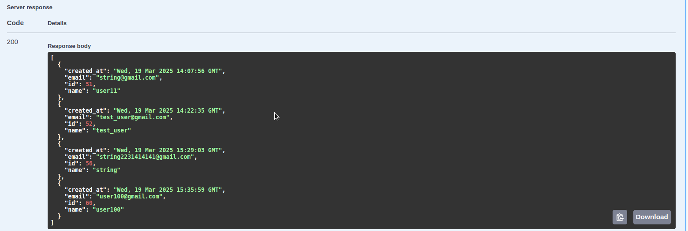
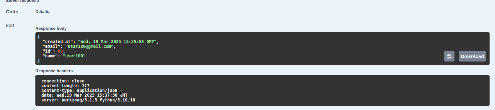
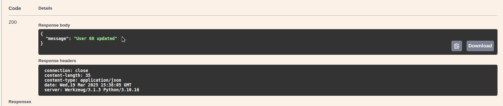
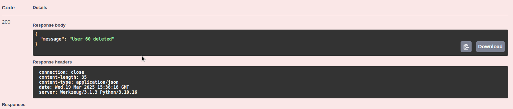

## REST API for User Management

This project contains a REST API for user management, built using Flask.

### To get started:

1. Clone the repository:
   ```bash
   git clone https://github.com/JustGithubProject/FlaskTestTask.git
   ```

   ```bash
   cd FlaskTestTask
   ```

2. Build and start the containers using Docker:
   ```bash
    docker-compose up --build
   ```

3. If you want to run tests
    ```bash
    docker exec -it backend sh
    ```

    ```bash
    pytest
    ```

4. Path to Swagger
   ```bash
   http://127.0.0.1:5000/swagger/
   ```


### GET Request


### GET BY ID Request


### POST Request


### PUT Request


### DELETE Request

