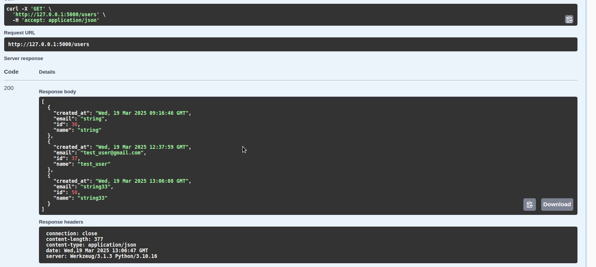
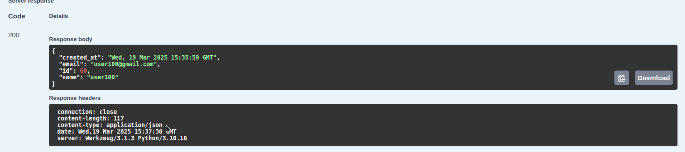
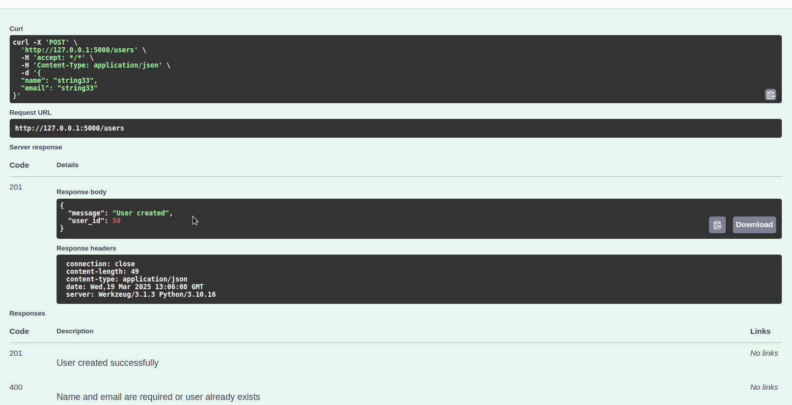
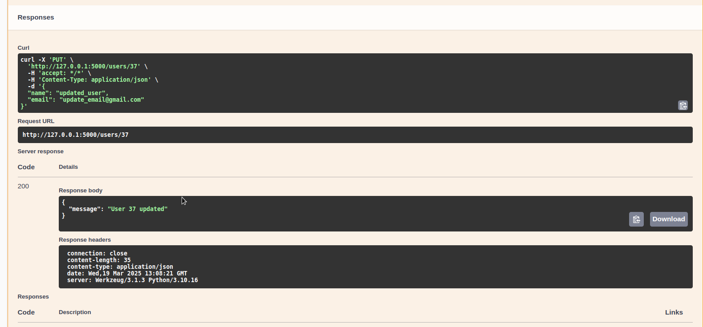
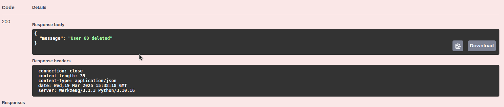

# Flask Test Task

## REST API for User Management

This project contains a REST API for user management, built using Flask.

### To get started:

1. Build and start the containers using Docker:
   ```bash
    docker-compose up --build
   ```

2. If you want to run tests
    ```bash
    docker-compose exec backend sh
    ```

    ```bash
    pytest
    ```





